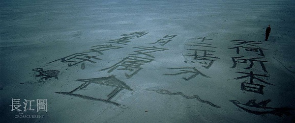
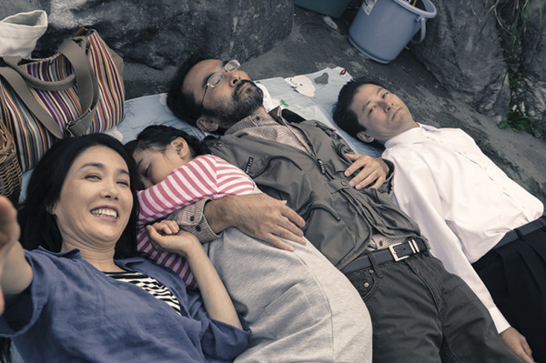

不知不觉间又过了一个星期，这个礼拜为了清理硬盘，硬着头皮看了一些库存的电影。（下载了，而长时间没有提起力气看。） 

# 杨超 ---《长江图》  
氤氲水汽的长江，在李屏宾的大师级影像中格外迷人。  
安陆仿佛长江的化身  
在时间和空间的构筑下，不禁让人沉浸其中。  

天何所沓 十二焉分  
日月安属 列星安陈  
节选自，屈原《天问》

[长江图](http://pan.baidu.com/s/1kUEXmdx)
o2ew

# 深田晃司 ---《临渊而立》
  
影片最后给人的感觉，是面对罪恶的万丈深渊，是一种无法纵然跃下，只能保持站立的惊惧感。

[临渊而立](http://pan.baidu.com/s/1nv3EcVB)
kisa

# 片渊须直 --- 《在这世界的角落》
这是一部与吉卜力工作室作品相当的艺术动画片。    
影片没有直面战争场面，却能让你无时不刻感觉到战争的存在。  
战争是如此的可怕、罪恶...

[在这世界的角落](http://pan.baidu.com/s/1gfMhnGn)
wjsn

# 李安 --- 《冰风暴》
影片围绕着Hood一家四口展开。父母的貌合神离，青春期反叛迷茫的女儿，心事重重的儿子。  
冰风暴到来前夕一切暗流涌动。

陀思妥耶夫斯基---《白痴》  
这本书是Paul在陀思妥耶夫斯基和存在主义课上推荐给Libbets妹子的书。  
最近经常的在影评里看到陀思妥耶夫斯基。
貌似陀思妥耶夫斯基对很多电影创作人员有所启发。  
孤陋寡闻的我，以前都没听过、看过他的书。  
看来要好好补课了！

# 李安 --- 《喜宴》
影片最让我印象深刻的是，在一个早晨，高父向Simon坦白了自己知道一切。Simon仿佛一个内疚的小孩如释重负，而高父带着宽容表达了对Simon的认同。

[喜宴](thunder://QUFmdHA6Ly9keTEzMS5jb206NnZkeS5jb21AZnRwMi42NmUuY2M6NjUyNy8lRTMlODAlOTA2diVFNyU5NCVCNSVFNSVCRCVCMXd3dy5keTEzMS5jb20lRTMlODAlOTElRTUlOTYlOUMlRTUlQUUlQjQuQkQlRTUlOUIlQkQlRTglQUYlQUQlRTQlQjglQUQlRTUlQUQlOTcxMDI0JUU5JUFCJTk4JUU2JUI4JTg1LnJtdmJaWg==)

# SNK --- 《The King Of Fighters XIII》
周末打折17元，没忍住，话说用手柄挺不习惯的，以前搓键盘，现在刚入手柄没多久，还是手生。  
以前玩的97，03版本相对13这个版本简单一些，至少连招打的出来。13的气槽教程都没过完，有点尴尬。  
街机的按键标识和手柄的不一样,慢慢熟悉系统吧。有空一起来搓几局~  

# SNK --- 《Metal Slug Collection》
这周是SNK发行商打折么，这套合集看着便宜也买了。  
可惜没人一起玩，没有小时候的感觉。好气啊...  
童年真的是越来越远...
